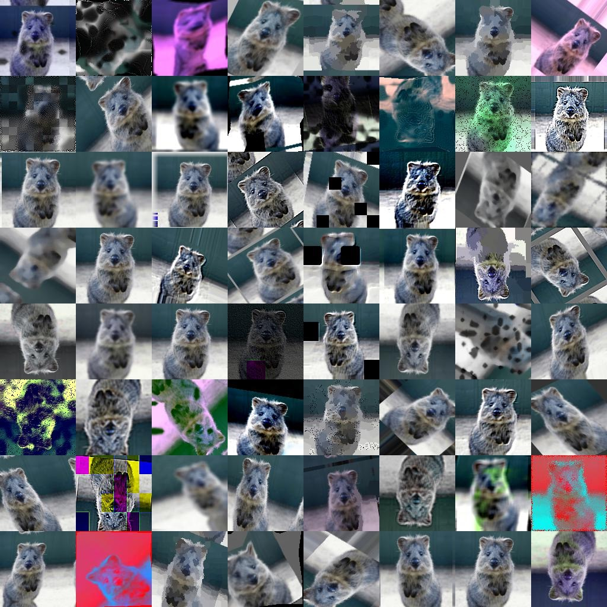

*[全球AI挑战赛](https://challenger.ai/)中场景分类的比赛源码，比赛已经告一段落，这里对总结一下比赛期间遇到的问题，踩的坑等做个总结。和[皮皮酱](https://github.com/WinterFu)一起参加了这次比赛，前期就报个名没怎么当回事，后期开始认真做的时候比赛还剩两周，已经接近尾声。一路踩坑到比赛结束，没少折腾。*

## 快速接入

* [下载数据集](https://challenger.ai/competition/scene/subject)


* 配置数据集路径

  打开`config.py`，找到下面的位置，根据自己的电脑系统在对应的位置配置上数据集路径

  ```
  # image path
  if is_windows():
      PATH_TRAIN_BASE = 'G:/Dataset/SceneClassify/ai_challenger_scene_train_20170904'
      PATH_VAL_BASE = 'G:/Dataset/SceneClassify/ai_challenger_scene_validation_20170908'
      PATH_TEST_B = 'G:/Dataset/SceneClassify/ai_challenger_scene_test_b_20170922/scene_test_b_images_20170922'
  elif is_mac():
      PATH_TRAIN_BASE = '/Users/zijiao/Desktop/ai_challenger_scene_train_20170904'
      PATH_VAL_BASE = '/Users/zijiao/Desktop/ai_challenger_scene_validation_20170908'
      PATH_TEST_B = ''
  elif is_linux():
      # 皮皮酱
      PATH_TRAIN_BASE = ''
      PATH_VAL_BASE = ''
      PATH_TEST_B = ''
  else:
      raise Exception('No images configured on %s' % os_name)
  ```

* 分类数据

  运行`split_by_class.py ` 脚本，分别对train数据集合val数据集进行按照子文件夹分类

* 开始训练

  找任一个`classifier` 开头的(`classifier_base` 除外)脚本进行运行，这里包含`VGG16/19`、`Xception`、`Inception-V3`、`Inception-Resnet-V2`等经典模型


## 要点概述

- [x] 支持多个单模型进行集成，可选多种集成方式
- [x] 支持多种集成方式间的任意组合和自动择优


- [x] 支持间断训练时权重文件的择优选择


- [x] 支持`VGG16`、`VGG19`、`Resnet50`、`Inception-V3`、`Xception`、`Inception-Resnet-V3`模型


- [x] `imgaug` 图片数据增强库替换Keras自带的图片预处理


- [x] 支持多进程进行图片预处理

      ​

## 血训

#### 数据增强很重要！！！

Keras自带的图片增强远远不够的，这里选择了[imgaug](https://github.com/aleju/imgaug)这个图片数据增强库，直接上图，这种效果是目前的Keras望尘莫及的，尽可能最大限度利用当前有限的数据集。<b>提高1~3个百分点</b>



#### 尽可能高效使用CPU！！！

训练任务交给GPU去做，新添加的imgaug图片处理方式之后，一个Epoch在1050Ti上耗时90mins+，排查发现大部分时间都在进行图片数据增强处理，于是将该部分的处理替换为多进程方式。<b>时间从90mins降到30mins左右</b>

#### 标准化很重要！！！

先计算出整体训练集的mean和std，然后在训练阶段的输入数据以mean和std进行高斯化处理（参[mean_var_fetcher.py](mean_var_fetcher.py)）<b>提高0.5~1.0个百分点</b>

#### Fine-tune别绑太紧！！！

这点尤为重要！Fine-tune时松太开，可能导致训练耗时，也可能导致机器带不动；绑太紧可能导致Fixed的权重参数扼制了模型的学习能力。建议是在能时间和机器方面能接受的基础下，尽可能松绑多一些。<b>提高2~5个百分点</b>

#### 模型选择很重要！！！

糟糕的模型训练几天几夜，可能赶不上优势模型训练几个epoch。<b>VGG16=>Xception提高5~8个百分点</b>

#### Loss降不下去时尝试调低LR！！！

降不下去就调小，调下的幅度一般是5倍、10倍左右。<b>提高1~3个百分点</b>

#### TensorbBoard监视训练状态！！！

尽可能使用Tensorflow提供的Tensorboard可视化工具，方便从宏观把控训练过程。

#### 适度过拟合是良性的！！！

训练过程中一直没有过拟合，要从两方面考虑：

* 模型太简单，拟合能力不足，这时要考虑增强网络复杂度 
* 数据增强程度太大，学不到某些特征

#### 模型集成！！！

单模型没有什么提升空间时，要尝试将多个单模型进行集成。集成的方式可以选择投票法、均值法、按照模型Acc加权法等等。<b>提高0.5~1.5个百分点</b>

#### 预测数据增强！！！

为了确保预测结果的准确性，可以将待预测结果进行水平翻转（或随机裁取patch等）处理，将这多张孪生图片进行预测，最终结果取多个结果的均值。<b>提高0.25~1.0个百分点</b>

#### 找个小伙伴一起搞！！！

想法x2，时间/2，还能互相讨论学习！<b>提高0~50个百分点</b>